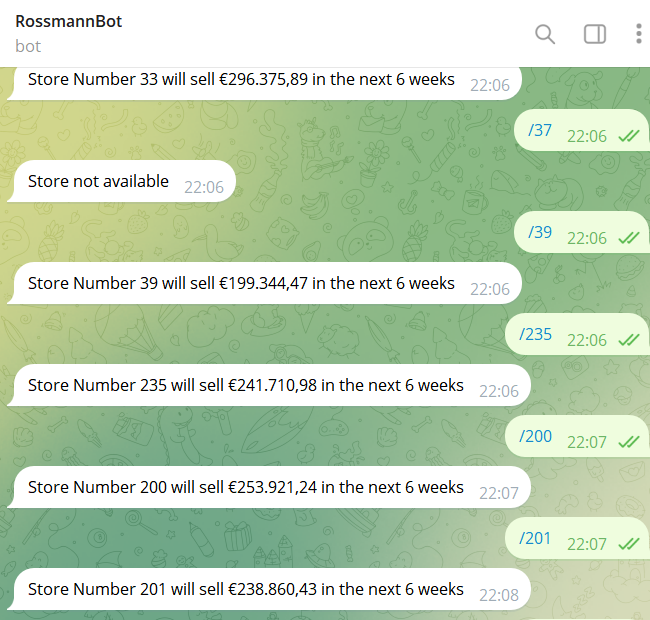

# ds_in_production

This project consists of developing a machine learning model capable of predicting six weeks of future sales for business decisions using historical data from the Rossmann Store Sales competition, available on the Kaggle platform.

To achieve this goal, the CRISP methodology presented in the Data Science in Production course of the Data Science program at the DS Community was used, through steps such as Business Understanding, Data Description, Feature Engineering, Data Analysis, Machine Learning Modeling and Deployment.

Using the Python language and technologies such as Pandas, NumPy, Scikit-Learn, Seaborn, XGBoost, Flask and others, the sales forecasting model was put into production using an API hosted on Render and integrated with a Telegram bot for real-time consumption.

- Telegram Bot: @rossmann26_bot
- API deployed on Render
- Rossmann Store Sales competition on Kaggle: https://www.kaggle.com/c/rossmann-store-sales

## Live Prediction Example

